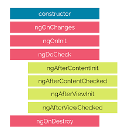

# Angular Entrevista Questões & Respostas

> Clique :star: Se você gostou desse projeto. Pull Request será muito apreciado. 


### Table of Contents

| No. | Questions |
|---- | ---------
|1 | [O que é Angular Framework](#o-que-é-angular-framework)|
|2 | [Qual a diferença entre AngualarJs e Angular?](#qual-a-diferença-entre-angularjs-e-angular)|
|3 | [ O que é TypeScript?](#o-que-é-typescript)|
|4 | [Descreva um diagrama pictório da arquitetura Angular? ](#descreva-um-diagrama-pictório-da-arquitetura-angular)|
|5 | [Quais são os principais componentes do Angular](#quais-sao-os-principais-componentes-do-angular)|
|6 | [O que são as directives?](#o-que-são-as-directives)|
|7 | [O que são components?](#o-que-são-components)|
|8 | [Qual a diferença entre um Component e uma Directive?](#qual-a-diferença-entre-um-component-e-uma-directive)|
|9 | [O que é um template?](#o-que-é-um-template)|
|10 | [O que é um module?](#o-que-é-um-module)|
|11 | [Qual são os ciclos de vidas disponíveis?](#qual-são-os-ciclos-de-vidas-disponíveis)|
|12 | [O que é data binding?](#o-que-é-data-binding)|

1. ### O que é Angular Framework?

    Angular é um **Projeto open source** para front-end, isto faz ser fácil construir aplicações para web/mobile/desktop. Os principais recursos desse framework, é modelos     larativos, DI(dependência de injeção), de ponta a ponta, e a maioria dos outros recursos são usados para facilitar o desenvolvimento. É mantido pela *google* em parceira com a *Microsoft*, que introduziu a linguagem *TypeScript*. O *Angular* 2+ não é continuação do Angular 1.x, oficialmente conhecido como *AngularJs*, ele foi reescrito. As aplicações *Angular* são orientadas as componentes, tudo que existe na aplicação é um componente, podendo ser facilmente reutilizado em qualquer lugar da aplicação.
  
2. ### Qual a diferença entre AngualarJs e Angular?

    Angular é um framework baseado completamente em componentes reutilizáveis, que na aplicação é uma árvore de componentes individuais.

    Os principais recursos diferentes é na sua receita de bolo.

    | AngularJs | Angular |
    |---- | ---------
    | É baseado na *Arquitetura MVC* | É baseado em Service/Controller |
    | Usa *JavaScript* para construir suas aplicações | Introduziu o *TypeScript* para escrever suas aplicações |
    | Baseado no conceito de controllers | Isto é baseado na abordagem de componente UI |
    | Não é amigável aos frameworks Mobile | Desenvolvido considerado as aplicações mobile |
    | Dificuldade e familaridade com Desenvolvimento de aplicações SEO | Fácil criar aplicações SEO, bem amigável |


3. ### O que é TypeScript?

    *TypeScript* é uma superconjunto de *JavaScript* desenvolvido pela *Microsoft* que adiciona a tipagem, classes, async/await, e alguns outros recursos da linguagem, compilando *JavaScript*. Angular é construindo interamente em *TypeScript* e usado como sua principal linguagem. 

    Você pode instalar isso globalmente
    ```
    npm install -g typescript 
    ```
    Vejamos um simples exempl usando *TypeScript*,
    ```typescript
    function greeter(person: string) {
        return "Hello, " + person;
    }

    let user = "Sudheer";

    document.body.innerHTML = greeter(user);
    ```
    O metodo greeter permite apenas o tipo de string como argumento.

4. ### Descreva um diagrama pictório da arquitetura Angular? 
    Os principais blocos de construção de uma aplicação *Angular* são mostrados abaixo
    

    O diagrama de arquitetura identifica os oito principais blocos de construção de um aplicativo Angular:
    1. **Modules**
    2. **Components**
    3. **Templates**
    4. **Metadata**
    5. **Data binding**
    6. **Directives**
    7. **Services**
    8. **Dependency injection**

5. ### Quais são os principais componentes do Angular?
    Abaixo os princiapais componetes Angular,
    1.  **Component:** Estes são os blocos basicos de construção de uma aplicação angular para controlar a exibição das views HTML.
    2. **Modules:** Um módulo angular é um conjunto de blocos de construção básicos, como componentes, diretivas, services, etc. Um aplicativo é divido em partes lógicas e cada parte do código é chamada de "módulo", que executa uma única tarefa.
    3. **Templates:** Isso representa a view de uma aplicação angular.
    4. **Services:**  É usado para criar components que podem ser compartilhados em todo aplicativo.
    5. **Metadata:** Isso pode ser usado para adicionar mais dados em uma classe Angular.


6. ### O que são as directives?
    Directives adiciona um comportamento a um DOM element existente ou a uma instância de component existente.
    ```typescript
    import { Directive, ElementRef, Input } from '@angular/core';

    @Directive({ selector: '[myHighlight]' })
    export class HighlightDirective {
        constructor(el: ElementRef) {
            el.nativeElement.style.backgroundColor = 'yellow';
        }
    }
    ```

    Agora esta diretiva estende o comportamento do elemento HTML, colocando o backgorund yellow sempre
    ```html
    <p myHighlight>Highlight me!</p>
    ```

7. ### O que são components?
    Os components são o bloco de construção de interface de usuário mais básico de um aplicativo *Angular* que formou uma árvore de componentes Angular. Estes componentes são um subcojunto de ``diretivas``. Ao contrário das ``diretivas``, os components sempre tem um template e apenas um componente pode ser instanciado por um elemento em um template. 
    Vamos ver um simples exemplo
    ```typescript
    import { Component } from '@angular/core';

    @Component ({
       selector: 'my-app',
       template: ` <div>
          <h1>{{title}}</h1>
          <div>Learn Angular8 with examples</div>
       </div> `,
    })

    export class AppComponent {
       title: string = 'Welcome to Angular world';
    }
    ```

8. ### Qual a diferença entre um Component e uma Directive?
    **Nota:** Em uma pequena nota, Um component(@component) é uma diretiva-com-um-template.

    As principais diferenças é mensionado na tabela abaixo.

    | Component | Diretiva |
    |---- | ---------
    | Para criar um componente devemos usar a anotação de metadados ``@Component`` | Para criar uma diretiva devemos usar a anotação de metadados ``@Directive`` |
    | Components são normalmente usados para criar widgets de interface do usuário | Diretiva é usado para adicionar um comportamento a um elemento DOM existente.
    | Components é usado para dividir sua aplicação em components menores | Diretiva é usado para projetar components reutilizáveis|
    | Um único component pode ser apresentado por DOM element | Muitas diretivas pode ser usados por um DOM element |
    | Anotação ``@View`` ou templateurl/template são obrigatórios | Diretivas não precisar usar ``@View``

9. ### O que é um template?

    Um template é uma exibição HTML na qual você pode exibir dados vinculados às propriedades de um component Angular. Você pode armazenar o template do seu  component em um dois lugares. Você pode definir usando template inline, ou você pode definir o template em um arquivo HTML separado e referênciando para ele nos metadados do component usando a propriedade templateUrl de metadados ``@Component``.

    **Usando template inline com template syntax,**
    ```typescript
    import { Component } from '@angular/core';

    @Component ({
       selector: 'my-app',
       template: '
          <div>
             <h1>{{title}}</h1>
             <div>Learn Angular</div>
          </div>
       '
    })

    export class AppComponent {
       title: string = 'Hello World';
    }
    ```
    **Usando template separado buscando arquivo app.component.html**
    ```typescript
    import { Component } from '@angular/core';

    @Component ({
       selector: 'my-app',
       templateUrl: 'app/app.component.html'
    })

    export class AppComponent {
       title: string = 'Hello World';
    }
    ```
10. ### O que é um module?

    Os modules são uma ótima maneira de organizar uma aplicação e estender recursos de bibliotecas externas. Modules são limites lógicos em seu aplicativo, o aplicativo é usado para separar as funcionalidades da aplicação. 
    vamos ver um exemplo **app.module.ts** os modules são declarados usando o metadados **@NgModule**
    ```typescript
    import { NgModule }      from '@angular/core';
    import { BrowserModule } from '@angular/platform-browser';
    import { AppComponent }  from './app.component';

    @NgModule ({
       imports:      [ BrowserModule ],
       declarations: [ AppComponent ],
       bootstrap:    [ AppComponent ]
    })
    export class AppModule { }
    ```
    O metadado NgModule tem algumas opções
    1. A opção imports é usado para importar outras depedências de modules. O BrowserModule é obritaróio para todas as aplicações em Angular.
    2. A opção declarations é usado para definir os components em seus repectivos modules.
    3. A opção bootstrap  é de autonicialização, informando ao Angular qual component será inicializado no aplicativo.

11. ### Qual são os ciclos de vidas disponíveis?
    O aplicativo angular passar por todo um conjuto de processos ou tem um cilcio de vida desde o início até o final do aplicativo.
    Essa imagem abaixo é uma representação dos cilicos de vidas. 
    

    A descrição de cada método de ciclo de vida é a seguinte,
    1. **ngOnChanges:** Quando o valor de uma propriedade associada a dados é alterado, esse método é chamado.
    2. **ngOnInit:** Isso é chamado sempre quando é inicializado algum directive/component depois que o angular exibe pela primeira vez as propriedades vinculadas.
    3. **ngDoCheck:** Isto é para detecção e para atuar em alterações que o Angular não pode ou não detectará sozinho.
    4. **ngAfterContentInit:** Isto é chamado depois que o Angular inicializou totalmente todo o conteúdo de uma diretiva/component.
    5. **ngAfterContentChecked:** É chamado em resposta depois que o Angular verifica o conteúdo projetado no componente.
    6. **ngAfterViewInit:** Isto é chamado em resposta após o Angualr inicializar as exibições do componente e dos seus filhos.
    7. **ngAfterViewChecked:** Isto é chamado em resposta após o Angular checar as exibições do componente e dos seus filhos.
    8. **ngOnDestroy:** Isto é chamado antes que o Angular destrua a diretiva/component .

12. ### O que é data binding?
    *Data binding* é um conceito central em *Angular* e permite definir a comunicação entre um component e o DOM, facilitando muito a definição de aplicatibvos interativos sem se preocupar em empurrar ou extrair dados. Existem quatro formas de *data binding* (divididas em três categorias) que diferem na maneira como os dados estão fluindo.
    1. **Do component para o DOM:**
    **Interpolação:** {{ value }}: Addiciona o valor da propriedade do component
    ```html
    <li>Name: {{user.name}}</li>
    <li>Address: {{user.address}}
    ```
    **Property binding:** [property]="value": O valor é passado do component para a propriedade específica ou simples HTML attributo
    ```html
    <input type="email" [value]="user.email">
    ```
    2. **Do DOM para o Component:**
    **Event binding: (event)=”function”:** Quando um específico evento acontece (ex: click, change, keyup), é chamado um método específico no component
    ```html
    <button (click)="logout()"></button>
    ```
    No component
    ```typescript
    logout() {
        console.log("Saiu");
    }
    ```
    3. ***Two-way binding:**
    **Two-way data binding:** [(ngModel)]==”value”: Two-way data binding é bidirecional permitindo que os dados fluam nos dois sentindos. Por exemplo, no código abaixo, tanto o INPUT(Element Dom) do email e a propriedade email estão sicronizadas.
    ```html
    <input type="email" [(ngModel)]="user.email">
    ```